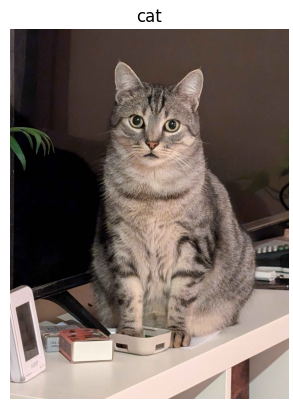

# CIFAR10 Image recognition

In my first deep-learning project I learned how to train a model to recognise image using convulutional layers.

I used the CIFAR10 dataset on Kaggle and my goal was to train a model that could recognize pictures of my cats.

I learned a lot about deep-learning technologies and also implemented Cuda in my program.

I spent a lot of time upgrading it and looking for small adjustements to be made to improve the accuracy of my model and attained an accuracy of 85% in the end.

The training loss curve over 30 epochs

Charlie recognized

Raptor recognized

